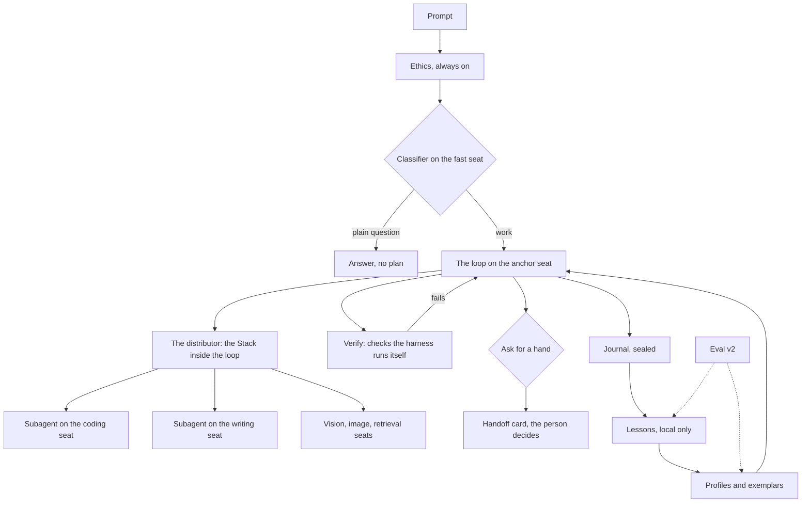

# Proposal: the premium agent harness (codename Keel)

Status: PROPOSAL, nothing built. Founder brief, 2026-09-14: "a premium coding
agent harness that can answer basic questions but is really there for dev
work, creative work, and agentic work"; the smallest models as capable as
possible through it; V1 harnesses the Stack so building feels like Claude Code
on any model; models recommend other models or setups when a request is beyond
them; local models keep learning from the person's builds. This document is the
integration plan, the honest inventory it rests on, and the founder's calls on
the forks (eight answered the same day, recorded at the end).

"Keel" is a working codename only, the way gitOS ships as Repositories and
botOS as routines. It ships with no room and no new name; it is simply how
OpenShore works. The CMO names it if it needs a name.

## The answer in ten lines

1. Build ONE harness as a portable pure core, and make the Stack its
   distributor inside the loop. Today there are two brains (the engine's ReAct
   loop and the app's play runner). V1 extracts the loop into a core with no
   Node dependencies that three hosts run: the desktop engine, the daemon
   (which is also the CLI), and the phone against its own tool slice. The
   phone feels like Claude Code in V1, not only when docked (founder's call).
2. The Claude Code contract is the baseline. Most of it exists. What is missing
   for the feel is subagents, skills, hooks, a verify phase, and checkpoints.
3. Small models get capable through discipline in the harness, not through
   hoping: a model-class profile per seat (tiny, small, mid, large) that sets
   what the model sees, how it must answer, and what the harness does for it.
4. Constrained decoding by default on small local models, with a schema that
   allows either a tool call or an answer, so the "grammar forbids prose"
   objection goes away.
5. The harness does the mechanical work itself: retrieval before the first
   turn, structural checks, running the project's own tests, feeding failures
   back. A small model with an external judge beats a large model without one.
6. "Ask for a hand" is a tool every seat has. The model names the need; the
   harness, not the model, names the candidate from the stack, the catalog
   (honest ratings, rated to the hardware), or a connected cloud key. A
   Settings switch, LLM Auto-Source, default on, lets the harness place a
   local model itself; off, it is always a card the person taps (founder's
   call). Cloud is never automatic either way.
7. Learning is local only and in tiers. V1: lessons as data (exemplar bank,
   outcome stats, proposed standing instructions), mined from the journals the
   engine already writes, inspectable in the Vault. V2: real adapters trained
   on the person's own computer, promoted only when the eval says they are
   better. Nothing ever leaves the device, so every public promise holds.
8. Eval is the spine. `osc eval` grows from three probes to a real harness
   benchmark, and it runs before, during, and after every step below, because
   nothing here can be claimed without it.
9. Every new surface is held to the interaction model and the motion bar.
10. Order: measure, then discipline, then the core and its three hosts, then
    the Stack inside the loop, then the Claude Code pieces, then the hand, then
    the lessons. Each step additive, behind config, tested, with the old path
    preserved.

## What you asked for, restated

| Ask                                                | What "done" means                                                                                            |
| -------------------------------------------------- | ------------------------------------------------------------------------------------------------------------ |
| A premium harness for dev, creative, agentic work  | One loop with tools, plans, subagents, skills, verification, memory; a fast path for a plain question        |
| Smallest models as capable as possible             | A measured lift on the eval for the 1.5B to 7B class, from harness changes alone, before any training        |
| V1 feels like Claude Code, on the Stack, any model | The Claude Code contract met on a local stack, with the Stack routing steps to seats inside the same loop    |
| Models recommend models or setups                  | A model can declare a need it cannot meet; the person sees an honest, grounded option and decides            |
| Local models keep learning from builds             | A local-only loop that makes the same model do better next week, on this machine, with nothing sent anywhere |

## The honest inventory

What is already there, what is partial, and what is missing. Paths are in
`openshore.code.ai`.

**Exists and is load-bearing.**

- The loop: `os-code/src/core/agent/loop.ts`. ReAct, streaming, four
  permission modes enforced in the loop, plan mode, todos, transient retries,
  parse repair with a grammar-constrained retry, compaction, title generation,
  the interaction-model rules in the system prompt.
- Tools and the edit engine: `core/tools/` (26 tools), `core/edit/` (exact,
  trimmed, then anchored fuzzy matching; ambiguity rejected; structural check
  before the write; a unified diff).
- The Stack: `router/` (roles, resolveStack, delegate, escalation target),
  `app/src/lib/stack.ts` (per-status stacks, seats, effort, vision slots).
- The plan-first play: `app/src/lib/play.ts` and `drivers/stackDriver.ts`
  (framing, clarify picker, dependency-ordered handoffs, re-plan, synthesis),
  app-native, with a tool step handed to the engine when docked.
- Memory and instructions: five project notes committed inside the repo
  (`core/agent/projectMemory.ts`), OSCODE.md / CLAUDE.md / AGENTS.md, the `#`
  shortcut, the UX standard and the humanizer as injected standards.
- Journals: every event sealed at rest in `~/.os-code/sessions/<id>/events.jsonl`,
  replayable, folded by Stack Health (`insights/stackHealth.ts`).
- The bridge for models without native tools: `core/tools/parser.ts`, plus
  per-backend capability probing (`providers/capabilities.ts`, `/api/show`).
- Safety: guardrails, security profiles, the jail, redaction, the ethics layer
  at the registry chokepoint.
- The Claude Code UI: modes, plan card, todos, slash commands, `@`, `#`, queue,
  approvals stack, repo chip, tool cards with diffs, changed-files card.

**Partial.**

- Delegation is a single-turn completion with no tools (`router.ts delegate`).
  A coding specialist cannot read or edit; it advises.
- The routing classifier is a keyword regex (`stackDriver.ts classifyTask`),
  marked as a placeholder.
- Escalation fires only on a failure streak. The config flag for a model
  asking for help, `routing.escalation.onModelRequest`, is declared and read by
  nothing.
- Small-model accommodations are the text bridge and a grammar retry after a
  failed parse. No per-model-class policy exists.
- `osc eval` is three probes (one tool call, one edit, one instruction),
  averaged, blessed at 0.8.
- Wayfinding's Skills switch is an honest label over the Skills memory note.
  There is no skill loader, no `SKILL.md` discovery, no skill invocation.
- Rehydration keeps only user and assistant text (`seed.ts`); tool
  trajectories are in the journal but nothing mines them.

**Missing.**

- Subagents with their own context. Hooks. A verify phase. Checkpoints and
  rewind. MCP. A browser driver. A model-initiated handoff. Any learning loop.
  Any per-model few-shot exemplars.

## The shape: one harness, four layers, one spine

**Layer 1, the loop.** The Claude Code contract. Today it lives in `loop.ts`;
it becomes a pure core (`os-code/src/harness/`, no Node built-ins, the way
`play.ts` and `stackHealthTypes.ts` are already pure) behind one `HarnessHost`
interface for tools, storage, and model transport. It grows subagents, skills,
hooks, verify, and checkpoints. Three hosts run it: the desktop engine
in-process, the daemon (which is what `osc` runs), and the phone.

**Layer 2, the distributor.** The Stack inside the loop. The anchor seat runs
the loop; a step that belongs to a seat runs as a subagent on that seat with
its own context, a role prompt, a filtered tool set, and a step cap. The plan
carries owners (the `owner` field on `TodoItem` already exists for this).

**Layer 3, the discipline.** A model-class profile per seat that decides what
the model is shown, how it answers, and what the harness does on its behalf.
This is the layer that makes small models capable.

**Layer 4, the lessons.** A local-only learning loop that mines journals into
exemplars, outcome stats, and proposed instructions, feeds them back into the
profiles and prompts, and in V2 into adapters.

**The spine, eval.** A real benchmark, per model class, run by `osc eval` and
as a routine, feeding the catalog's ratings with provenance.

## V1: feels like Claude Code, on any model

The contract, with what is left to build.

| Claude Code piece                         | State    | V1 work                                                                                                     |
| ----------------------------------------- | -------- | ----------------------------------------------------------------------------------------------------------- |
| Modes, plan mode, todos, approvals, queue | Built    | None                                                                                                        |
| Slash, `@`, `#`, instructions, `/init`    | Built    | None                                                                                                        |
| Compaction, resume, titles, repo chip     | Built    | None                                                                                                        |
| A plan with owners, on every host         | App only | `play.ts` (pure, tested) becomes the core's planner; plan mode ends in a plan with owners on every host     |
| Subagents (Task tool)                     | Missing  | `runSubagent`: a child `AgentSession` on a seat, own history, filtered tools, step cap, nested events       |
| Skills                                    | Missing  | `SKILL.md` discovery (global, project, the Skills note), names and one-liners in the prompt, body on demand |
| Hooks                                     | Missing  | `hooks` in `os-code.config.json`: pre and post tool, pre commit, on task done; shell risk class, ask once   |
| Verify before claiming                    | Missing  | A verify phase after the last edit: project checks from the Skills note or hooks, bounded feedback rounds   |
| Checkpoints and rewind                    | Missing  | Snapshot touched files before each write; Rewind on the tool card restores and folds the transcript         |
| A real classifier                         | Regex    | One constrained enum call on the fast seat (or Harbor Mini); cached; falls back to the anchor               |
| MCP stdio, browser                        | Missing  | V1.5                                                                                                        |

**One loop, three hosts (founder's call: the phone feels like Claude Code in
V1).** The loop becomes a pure core that any host can run, and the difference
between hosts is only the tool slice and the transport the host hands it.

- **Desktop engine.** In-process, the full tool set, the local-interactive
  profile. What the coding chat is today.
- **Daemon and CLI.** The same core headless over the tailnet, the remote and
  headless profiles, and `osc` in a terminal. The CLI gets the harness through
  the engine at no extra cost; rendering the new cards in the parked TUI is a
  separate call (below).
- **Phone.** The same core in the app, on the phone's own Stack, against a
  phone tool slice: vault read and write, repositories through the gitOS seam
  (read, and writes buffered through the outbox grain the CTO ruled for
  phones), the GitHub contents client, web search and fetch, project memory
  read, todos, the vision seat, and `askForHand`. A step that needs a real
  checkout, a shell, or the project's tests runs as a subagent on the paired
  engine when docked, exactly as the play hands a tool step off today, and
  lands as a described change with an outbox proposal when not docked.
  `StackDriver` stops being a second runner and becomes the phone host.

The standing principle (2026-08-25: long work runs off the phone) is applied,
not reversed: the phone runs the harness in the foreground for phone-sized
work, and unattended or long work still goes to the engine. iOS suspension
ends a phone run honestly (the conversation is persisted; a resume replays
it), and the copy never claims otherwise. The pure core must not pull a Node
built-in into the WebView bundle; `os-code/protocol` is the precedent.

**Basic questions.** The classifier tags a plain question as chat, and the
fast seat (or the anchor) answers with no plan, no tools, and no brief, the
way Claude Code answers a question. Work gets the loop.

**Creative work.** The writing seat and the humanizer exist, as do image
generation and vision. The harness treats a creative task like a build: a
plan, drafts as files (the Vault or a repo), and a verify phase that reads the
draft back against the humanizer and the brief. The coding tools already
edit markdown. Founder's call: creative work in V1 is writing and images
through these seats; audio, video, and design assets are a later brief.

**Agentic work.** Routines, Currents, subagents, and hooks together. A routine
is a headless harness run; a Current is a seat that lives on another computer;
a subagent is a seat with its own context. The cross-device control model
(set up and control only when docked, view anywhere) stays as ruled.

## Small models, made capable

This is the engineering heart. Everything here is harness-side and
model-agnostic; none of it needs training.

**Model-class profiles.** Derived from catalog size, the live capability probe
(tools, vision, grammar, context), and the eval score; overridable per seat.

| Class | Size          | Tools shown | Calls per turn | Decoding               | May run subagents | Plans                                |
| ----- | ------------- | ----------- | -------------- | ---------------------- | ----------------- | ------------------------------------ |
| tiny  | under 3B      | at most 6   | 1              | constrained            | no                | no; receives a plan or the fast path |
| small | 3B to 8B      | at most 10  | 1 to 2         | constrained by default | as a worker       | short                                |
| mid   | 8B to 32B     | full        | many           | native where probed    | yes               | yes                                  |
| large | 32B and cloud | full        | many           | native                 | yes               | yes                                  |

**Context discipline.** A per-class budget for the system prompt, the code
map, observations, and the compaction threshold. Tool descriptions for the
tools the step needs, not all 26. Skill bodies on demand. A tiny seat sees a
short adapter preamble, not the full standards (the context carve-out the UX
standard and the humanizer already make for pocket models).

**Constrained decoding by default.** Today the grammar constraint is a repair
tool, because a permanent JSON constraint would forbid a prose answer. The fix
is the schema: a union of `{kind: "tool", name, args}` and
`{kind: "say", text}`. Ollama, llama.cpp, vLLM, and LM Studio all take a JSON
schema (`ChatRequest.jsonSchema` already carries it). Streaming prose still
works by revealing the string as it arrives. Some models pay a quality tax
under constraint, so the profile turns it on for tiny and small and the eval
decides per family; mid and large keep native tools where the probe says so.

**One call per turn, and the harness does the rest.** Small models fail on
long tool chains, not on single calls. The profile caps calls per turn and the
harness carries the checklist: it runs the structural check, the formatter
hook, the tests, and feeds back one compact observation. The model never has
to remember to verify.

**Retrieval before the first turn.** The harness runs `searchRepo` (the
embedding seat, or keyword) on the task and puts the top chunks in the first
turn, so the model starts where the code is instead of spending three turns
finding it. A `symbol` lookup over the code map ("where is `resolveStack`
defined") is a cheap read tool small models use well.

**Effort-matched routing.** Classification, titles, summaries, and compaction
run on the fast seat. Planning runs on the anchor. Edits run on the coding
seat. Cheap work never touches the biggest model, and a modest desktop
stack stays responsive.

**Bounded second opinions.** Local inference is free; only latency costs.
When a small anchor is stuck (a failed edit twice, a plan that will not
parse), the harness asks for two or three candidates and picks by a
deterministic check (does the diff apply, do the tests pass) rather than a
judge model. Bounded and off by default for the tiny class.

**Exemplars.** Each tool description can carry one or two worked examples
for the model's family, drawn from the lessons bank (below). This is the
single cheapest lift for the 1.5B to 4B class and it costs no training.

**Where the ceiling is.** A 1.5B will not plan a five-step refactor, and the
harness should not pretend. The tiny class receives plans, runs single
steps, and answers questions; Harbor Light stays a concierge. Honest copy in
the Stack ("this seat runs single steps") is part of the build.

## Model-agnostic, and "ask for a hand"

**The tool.** `askForHand({need, why, tried})`, available to every seat, in
the loop and in a subagent. `need` is an enum: vision, larger context,
stronger reasoning, coding, image generation, web, a named skill, other. The
model names the need. It never names a model.

**The resolution, by the harness.** In order: an idle seat in the stack that
has the capability; a benched model that has it; a catalog model that fits
this hardware, with its honest rating and provenance; a connected cloud
provider on the person's key (amber, and spend asks). Grounded in the catalog's
`perCapability` stars and `osCodeFit`, never in a model's opinion, which keeps
the Marketplace's "honest ratings" promise intact.

**The card.** A `handoff` event renders a card: "Qwen 7B cannot read this
image. Options: place LLaVA 7B (4.1 GB, fits this machine), or use Claude on
your key (asks before spend)." The person taps; the seat is placed (or the
install starts through the existing channel), and the step re-runs. This
resurrects the dead `routing.escalation.onModelRequest` flag.

**LLM Auto-Source (founder's call, 2026-09-14).** A Settings switch, default
on. On, the harness sources a local model itself when a seat cannot do the
step: a model already installed on this machine or sitting on the bench is
placed with no card, a note in the transcript ("Placed LLaVA 7B for image
reading"), a seat badge "auto-sourced", and one tap to put it back. A model
that fits but needs a download starts on its own on the desktop and when
docked (local, free, disk is there) and shows the card on a phone alone
(memory and data plan; the storefront rule that "Get" never appears for a
model the phone cannot take holds). Off, every hand is a card the person taps.
Cloud is never automatic in either state: a cloud option is always the card,
amber, and spend asks. The site's "You decide who sits in each seat" gains
"or let Auto-Source do it for you" in the same change, per the mirror rule.

**Pre-empting.** The harness already knows a seat's capabilities before it
tries (vision, tools, context). A step that needs 40k of context on an 8k
seat raises the card before the failure, not after it.

**Setup recommendations.** The same card covers a setup, not just a model:
"Your anchor has an 8k context; this repo's code map alone is 6k. A 32k seat
or a smaller code-map budget would help." The Run leaner optimizer is the
precedent: advisory, read-only, capability-parity gated.

## Learning from builds, local only

The public promise is absolute and repeated: no telemetry, ever; nothing
leaves the machine; we never see your code. Everything here honors it by
construction. Nothing is aggregated across people. The "PARKED" cross-user
leaderboard ruling stands: any community share is its own opt-in build on the
founder's explicit yes, not part of this.

**Tier 1 (V1): lessons as data.** Mined from the journals the engine already
writes (tool-start and tool-end are in them; only rehydration drops them).

- **Exemplars.** Successful tool trajectories per tool per model family,
  stored as few-shot candidates, chosen by similarity for the next prompt.
  This is what makes the same 4B do better next week.
- **Outcome stats.** Per model, per task class: edits that applied, tests
  that passed, steps to done, hand requests raised. Stack Health already folds
  turns and outcomes per model; this adds the task class. The stats tune the
  profile (a model that fails edits over 60 lines gets edits split) and
  inform the hand ("stronger reasoning was needed five times this week").
- **Proposals.** The system prompt already tells the model to propose a line
  for the standing instructions when it learns how the person works, with no
  machinery behind it. A `lesson-proposal` event renders a card; accept
  writes it to the project instructions or a global `~/.os-code/USER.md`.
  Never silent, per the ruling that agent writes are user-directed or
  agent-proposed with approval.
- **Skills drafted.** What worked (the test command, a gotcha) is proposed
  into the project's Skills note through the existing `projectMemoryWrite`
  path, so it rides into the repo with the change.

Storage: `~/.os-code/lessons/`, sealed at rest like the journals, per machine.
Surfaces: a Wayfinding row, "Lessons", default on, with one honest line
("Learns from your builds on this computer. Nothing leaves it."), and a
read-only Lessons folder in the Vault (the Hermes notes pattern). The ethics
layer's blocked requests never enter the bank; a block records a category and
a hash, never a prompt, and that stays true.

**Tier 2 (V2): adapters.** Real weight updates on the person's own computer.
A trainer sidecar (Python, PEFT-style LoRA) on Linux with an NVIDIA GPU
first; data is the accepted exemplars and accepted diffs; a nightly Crew
routine, "Practice", runs while the computer is on; the output is an adapter
loaded through an Ollama Modelfile as a new tag ("qwen2.5-coder:7b, yours").
Promotion only when eval v2 scores the adapted model at or above the base;
the seat shows "adapted on <date>" and a one-tap revert. Not for the phone.
This is the literal "trains itself" and it costs GPU hours and carries a
forgetting risk. Founder's call: V1 is Tier 1 only. The founder's desktop has
under 12 GB of VRAM or is not NVIDIA, so the V2 spike starts with a hardware
check and a small base (a 1.5B to 4B under QLoRA fits in 8 GB), or on other
hardware.

**What V1 learning is, honestly.** In-context learning: retrieval of lessons
and exemplars into the prompt. For small models that is where most of the
gain is, at zero training cost, and it is provable with the eval. The
copy says "learns from your builds," never "trains itself," until Tier 2
ships.

**The mirror rule.** Any new on-device record must appear in the trust
statement in Settings and on the site in the same piece of work. Lessons
adds one line: "Lessons stay on this computer."

## Eval as the spine

Nothing above can be claimed without measurement, so eval v2 is step zero.

- **Fixture repos** under `os-code/eval-fixtures/`: a small TypeScript
  package with a failing test, a Python script, a markdown doc.
- **Tasks**: fix the failing test; add a function with a test; rename across
  files; answer a question from the code; plan a three-step change; recognize
  a vision need and ask for a hand; work inside an 8k context.
- **Scoring is deterministic**: tests pass, the diff applies, the JSON is
  valid, the hand was raised. No judge model.
- **Per model class**, with and without each harness feature, so every claim
  in this document ("constrained decoding lifts the 4B") is a number.
- **Outputs**: `~/.os-code/eval/`, the catalog's `osCodeFit` with
  `provenance: "osc eval v2"`, the profile's inputs, adapter promotion.
- **Harness regression**: golden journals replayed against a mock provider
  (the pattern `agentModes.test.ts` starts).

## How it feels

Held to `docs/interaction-model.md` and the motion standard.

- **Subagent card.** A nested, collapsible card named by the seat ("Coding
  seat: Qwen 7B"), its own tool rows inside, folding to one line when done.
- **Verify row.** "Ran pnpm test (42 passed)" in the transcript, with the
  task-done card saying verified, not verified, or skipped. Tenet 6 as
  machinery.
- **Handoff card.** Options as a picker with a recommendation and one-line
  trade-off, teal for local, amber for cloud. Tenet 3.
- **Lesson card.** "I noticed you always run prettier before commit. Add to
  standing instructions?" Accept, edit, dismiss.
- **Rewind.** On a tool card; the transcript folds the undone turns.
- **The seat badge.** "Adapted 12 Sep" on a seat with an adapter, and "runs
  single steps" on a tiny seat.

Every card arrives and leaves on the tokens, transform and opacity only,
press feedback on every tappable, reduced motion honored.

## Where the code goes

The core, pure, exported through `os-code/protocol` so the app imports it
with no Node built-in:

- New `os-code/src/harness/`: `host.ts` (the `HarnessHost` interface: tool
  slice, storage, transport, approver), `loop.ts` (the loop, moved out of
  `core/agent/loop.ts` piece by piece), `planner.ts` (today's `play.ts`),
  `profile.ts` (the model class), `decoding.ts` (the union schema),
  `subagent.ts`, `skills.ts`, `hooks.ts`, `verify.ts`, `handoff.ts`
  (including Auto-Source), `checkpoint.ts`, `classify.ts`, and `lessons/`
  (store, mine, exemplars, proposals).
- `types.ts` gains additive events: `parent` on nested events, `handoff`,
  `verify`, `checkpoint`, `lesson-proposal`.

Engine host, additive:

- `core/agent/loop.ts` becomes the engine host adapter over the core, with
  the full tool registry, the jail, and the profiles it has today.
- `registry.ts` gains `runSubagent` (the `delegate` upgrade), `useSkill`,
  `askForHand`, `symbol`.
- `config/schema.ts` gains `harness: {profiles, decoding, verify, hooks,
lessons, autoSource}`; an empty config stays a valid, working setup.
- `eval/` v2 with fixtures.
- Daemon routes and Electron IPC parity for lessons and skills listing. The
  CLI gets the harness through the daemon path.

Phone host, additive:

- `app/src/harness/phoneHost.ts` and `app/src/harness/tools/`: the phone tool
  slice (vault, gitOS repositories with outbox writes, GitHub contents, web
  search and fetch, project memory read, todos, vision, `askForHand`).
- `drivers/stackDriver.ts` becomes the phone host driver; its planner and
  runner code moves into the core; the docked hand-off to the engine stays.
- `transcript.ts` cases for the new events; `SubagentCard`, `HandoffCard`,
  `VerifyRow`, `LessonCard`, Rewind on `ToolCard`.
- Settings: Wayfinding rows (Skills becomes real, Lessons is new) and the
  LLM Auto-Source switch.
- The Vault's Lessons folder through the existing read-only note sheet.
- `StackManager` seat badges ("auto-sourced", "runs single steps").

## Phasing and order

Each step ships additively behind config, with tests, gates green, a
PROGRESS entry, and the previous path intact.

| Step | What                                                           | Why this order                                    |
| ---- | -------------------------------------------------------------- | ------------------------------------------------- |
| 0    | Eval v2                                                        | Measure before changing anything (founder's call) |
| 1    | Profiles, constrained decoding, context discipline, retrieval  | The small-model lift, provable on day one         |
| 2    | The pure core and its three hosts, the phone tool slice        | One loop everywhere before it grows               |
| 3    | Plan with owners on every host, the classifier, subagents      | The Stack inside the loop                         |
| 4    | Skills, hooks, verify, checkpoints                             | The Claude Code feel completes                    |
| 5    | Ask for a hand, the handoff card, LLM Auto-Source              | Needs profiles and the catalog wiring from 1      |
| 6    | Lessons tier 1                                                 | Needs journals with subagent events from 3        |
| 1.5  | MCP stdio, the browser driver                                  | Promised (Wayfinding) or listed follow-ups        |
| V2   | Adapters: a hardware check, a spike, then the Practice routine | Only with eval v2 as the gate                     |

## Risks and honest limits

- **Two runners during the transition.** The app's play and the engine's loop
  both exist until step 2 lands. The rule is additive: the core is extracted
  piece by piece behind the same events, and each host switches over when its
  tests pass. No rewrite.
- **The phone's limits.** iOS grants no background compute, so a phone run
  ends when the app is suspended; the harness resumes from the persisted
  conversation and says so. Repo writes from the phone go through the outbox
  grain, never a shell, per the gitOS ruling. Hooks and the verify phase that
  run a project's tests need the paired engine.
- **Bundle weight.** The core must stay free of Node built-ins or it cannot
  load in the WebView; a guard test (the `os-code/protocol` pattern) pins it.
- **The constraint tax.** Constrained decoding can flatten some models. The
  profile is per family and the eval decides; nothing is turned on by belief.
- **Latency of second opinions.** Bounded, off for tiny, and the eval must
  show the win.
- **Training hardware.** Adapters need a desktop GPU. The phone never trains.
  Honest copy from day one.
- **Forgetting.** An adapter can make a model worse. Promotion is gated by
  the eval and revert is one tap.
- **The privacy line.** Lessons add a new on-device record. It changes
  nothing that leaves the device, but the trust statement and the site must
  say it in the same change.
- **Small-model ceilings.** The harness raises the floor, not the ceiling. A
  tiny seat runs single steps and the copy says so.

## Decisions (founder, 2026-09-14)

Nine forks were put to the founder as pickers with a recommendation. Eight
are answered; the calls that differ from the recommendation are marked.

1. **Where V1 runs.** DIFFERS: the harness runs on the phone, the desktop,
   and the CLI in V1. "It's important V1 allows for phone to feel like Claude
   Code, not just desktop and CLI." Hence the pure core and three hosts.
2. **V1 learning ambition.** Lessons as data only. Adapters are V2.
3. **The hand's autonomy.** DIFFERS: a Settings switch, LLM Auto-Source,
   default on (the harness may place a local model itself); off is always a
   card. Cloud never automatic.
4. **Creative work.** Writing and images through the existing seats.
5. **Specialist seats get tools.** Yes, seats become subagents.
6. **Constrained decoding.** Default on for tiny and small, eval-gated per
   family.
7. **Eval first.** Yes, step 0.
8. **The name.** Open. Keel stays a codename until the CMO says otherwise.
9. **The founder's box.** Under 12 GB of VRAM or not NVIDIA. The V2 adapter
   spike starts with a hardware check and a small base.

**Two calls raised by the answers, still open.**

- **The CLI.** The TUI is parked (2026-08-18: no new features land on it).
  The harness reaches `osc` through the daemon for free, but rendering the
  new cards (subagent, verify, handoff, lesson) in the TUI unparks it.
  Recommendation: leave the TUI parked in V1; the CLI runs the harness and
  prints the new events as plain rows, the way `--plain` does today.
- **Auto-Source and downloads.** The proposal above starts a fitting download
  on its own on the desktop and when docked, and shows the card on a phone
  alone. A founder yes or a stricter line ("downloads always ask") is one
  word.

## Assumptions made while writing this

- The Currents and Wayfinding rulings hold: no new room, a current is never
  named in a room, "always on" is never said.
- "Off-device is where long work runs" is applied, not reversed: the phone
  runs the harness in the foreground; unattended and long work goes to the
  engine.
- The cross-user leaderboard stays parked; no learning crosses people.
- The Personal pay gates stay off during the beta; nothing here changes what
  is gated.
- The em-dash policy, the motion guards, and the PROGRESS shape guard apply
  to every file this proposal would touch.
