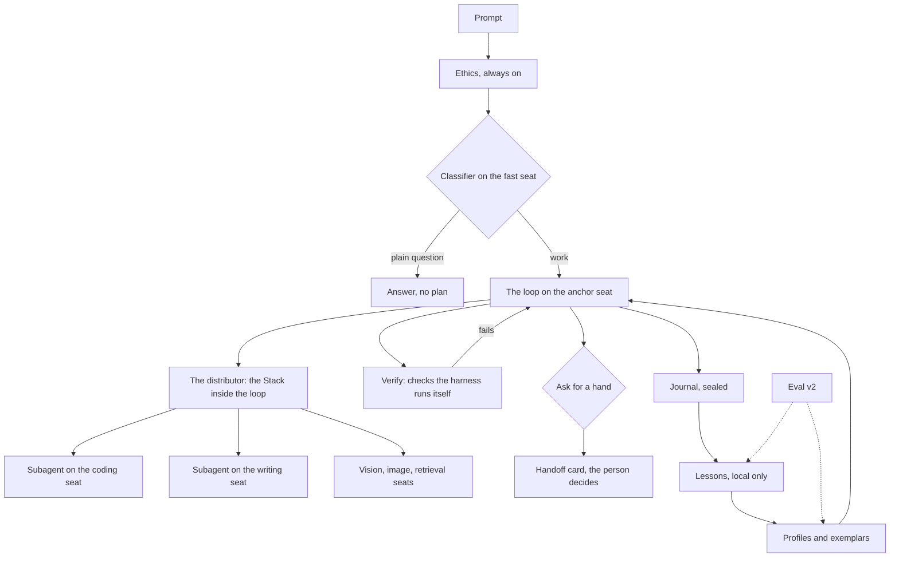

# Proposal: the premium agent harness (codename Keel)

Status: PROPOSAL, nothing built. Founder brief, 2026-09-14: "a premium coding
agent harness that can answer basic questions but is really there for dev
work, creative work, and agentic work"; the smallest models as capable as
possible through it; V1 harnesses the Stack so building feels like Claude Code
on any model; models recommend other models or setups when a request is beyond
them; local models keep learning from the person's builds. This document is the
integration plan, the honest inventory it rests on, the founder's calls on the
forks (eight answered the same day), and the advisor team's consensus on the
way forward (all eight advisors, the same day; the memos are in
`premium-harness-advisory-memos.md`). The consensus revised the plan; where a
section below reads differently from the founder's first call, the consensus
section at the end says why.

"Keel" is a working codename only, the way gitOS ships as Repositories and
botOS as routines. It ships with no room and no new name; it is simply how
OpenShore works. The CMO names it if it needs a name.

## The north star (founder, 2026-09-15)

You should not need a state-of-the-art chip to run OpenShore. A better machine
buys more headroom and more options; it is never the price of entry. The bar is
this: someone on a five-year-old MacBook should feel as powerful as if they were
running Claude-grade models on their own local stack. The reference machine is
therefore the lowest common denominator on purpose (the founder's own box:
older, CPU-only, a 7B at 3 to 7 tokens per second); a number that holds there
holds for almost anyone.

The honesty bar holds this promise up. A small local model is not secretly a
frontier model, and the copy never says it is. What delivers the FEELING of
that power is the harness doing the work the model cannot: retrieval so the
model need not remember, the project's own tests run and their failures handed
back until the change holds, the best of a few tries judged by those tests, and
a deliberate hand to a frontier model on the person's own key only when the task
truly needs it. The person feels capable and in control; the machinery, not a
pretended weight upgrade, is what earns the feeling. This is the founder's
"code like Sonnet, however we get there," stated as a promise to the person on
the oldest machine in the room.

## The answer in ten lines

1. Build ONE harness as a portable pure core, and make the Stack its
   distributor inside the loop. Today there are two brains (the engine's ReAct
   loop and the app's play runner). V1 extracts the loop into a core with no
   Node dependencies that three hosts run: the desktop engine, the daemon
   (which is also the CLI), and the phone against its own tool slice. The
   phone feels like Claude Code in V1 (founder's call): docked, it gets every
   new card through the engine path from the first step; alone, it runs the
   core for phone-sized work, built last and gated (consensus).
2. The Claude Code contract is the baseline. Most of it exists. What is missing
   for the feel is subagents, skills, hooks, a verify phase, and checkpoints.
3. Small models get capable through discipline in the harness, not through
   hoping: a model-class profile per seat (tiny, small, mid, large) that sets
   what the model sees, how it must answer, and what the harness does for it.
4. Constrained decoding by default on small local models, with a schema that
   allows either a tool call or an answer, so the "grammar forbids prose"
   objection goes away. It lives at the provider and adapter layer, so free
   chat gets the lift too and the loop is not rewritten twice (consensus).
5. The harness does the mechanical work itself: retrieval before the first
   turn, structural checks, running the project's own tests, feeding failures
   back. A small model with an external judge beats a large model without one.
6. "Ask for a hand" is a tool every seat has. The model names the need; the
   harness, not the model, names the candidate from the stack, the catalog
   (honest ratings, rated to the hardware), or a connected cloud key, local
   first. A Settings switch, Auto-place, default on, lets the harness place a
   model already on this machine or on the bench itself (founder's call);
   every download and every cloud call is a card the person taps (consensus,
   eight of eight).
7. Learning is local only and in tiers. V1: lessons as data (exemplar bank,
   outcome stats, proposed standing instructions), mined from the journals the
   engine already writes, per person and per workspace, inspectable in the
   Vault, cleared with the chats. V2: real adapters trained on the person's
   own computer, promoted only when the eval says they are better. Nothing
   ever leaves the device, so every public promise holds.
8. Eval is the spine. `osc eval` grows from three probes to a real harness
   benchmark that runs the loop, and it runs before, during, and after every
   step below, because nothing here can be claimed without it. It ships as a
   nightly routine so it never waits on a person.
9. Every new surface is held to the interaction model and the motion bar, and
   the team is felt, not read: the Creative Studio's "current in the thread."
10. Order: measure, then discipline at the seam, then the Claude Code moment
    on the engine (verify, rewind, hooks), then the hand, then the core
    extraction as a pure move with subagents and the plan, then the phone
    host, then the lessons. Each step additive, behind config, gated by a
    number, with the old path preserved.

## What you asked for, restated

| Ask                                                | What "done" means                                                                                            |
| -------------------------------------------------- | ------------------------------------------------------------------------------------------------------------ |
| A premium harness for dev, creative, agentic work  | One loop with tools, plans, subagents, skills, verification, memory; a fast path for a plain question        |
| Smallest models as capable as possible             | A measured lift on the eval for the 1.5B to 7B class, from harness changes alone, before any training        |
| V1 feels like Claude Code, on the Stack, any model | The Claude Code contract met on a local stack, with the Stack routing steps to seats inside the same loop    |
| Models recommend models or setups                  | A model can declare a need it cannot meet; the person sees an honest, grounded option and decides            |
| Local models keep learning from builds             | A local-only loop that makes the same model do better next week, on this machine, with nothing sent anywhere |

## The honest inventory

What is already there, what is partial, and what is missing. Paths are in
`openshore.code.ai`.

**Exists and is load-bearing.**

- The loop: `os-code/src/core/agent/loop.ts`. ReAct, streaming, four
  permission modes enforced in the loop, plan mode, todos, transient retries,
  parse repair with a grammar-constrained retry, compaction, title generation,
  the interaction-model rules in the system prompt.
- Tools and the edit engine: `core/tools/` (26 tools), `core/edit/` (exact,
  trimmed, then anchored fuzzy matching; ambiguity rejected; structural check
  before the write; a unified diff).
- The Stack: `router/` (roles, resolveStack, delegate, escalation target),
  `app/src/lib/stack.ts` (per-status stacks, seats, effort, vision slots).
- The plan-first play: `app/src/lib/play.ts` and `drivers/stackDriver.ts`
  (framing, clarify picker, dependency-ordered handoffs, re-plan, synthesis),
  app-native, with a tool step handed to the engine when docked.
- Memory and instructions: five project notes committed inside the repo
  (`core/agent/projectMemory.ts`), OSCODE.md / CLAUDE.md / AGENTS.md, the `#`
  shortcut, the UX standard and the humanizer as injected standards.
- Journals: every event sealed at rest in `~/.os-code/sessions/<id>/events.jsonl`,
  replayable, folded by Stack Health (`insights/stackHealth.ts`).
- The bridge for models without native tools: `core/tools/parser.ts`, plus
  per-backend capability probing (`providers/capabilities.ts`, `/api/show`).
- Safety: guardrails, security profiles, the jail, redaction, the ethics layer
  at the registry chokepoint.
- The Claude Code UI: modes, plan card, todos, slash commands, `@`, `#`, queue,
  approvals stack, repo chip, tool cards with diffs, changed-files card.

**Partial.**

- Delegation is a single-turn completion with no tools (`router.ts delegate`).
  A coding specialist cannot read or edit; it advises.
- The routing classifier is a keyword regex (`stackDriver.ts classifyTask`),
  marked as a placeholder.
- Escalation fires only on a failure streak. The config flag for a model
  asking for help, `routing.escalation.onModelRequest`, is declared and read by
  nothing.
- Small-model accommodations are the text bridge and a grammar retry after a
  failed parse. No per-model-class policy exists.
- `osc eval` is three probes (one tool call, one edit, one instruction),
  averaged, blessed at 0.8.
- Wayfinding's Skills switch is an honest label over the Skills memory note.
  There is no skill loader, no `SKILL.md` discovery, no skill invocation.
- Rehydration keeps only user and assistant text (`seed.ts`); tool
  trajectories are in the journal but nothing mines them.

**Missing.**

- Subagents with their own context. Hooks. A verify phase. Checkpoints and
  rewind. MCP. A browser driver. A model-initiated handoff. Any learning loop.
  Any per-model few-shot exemplars.

## The shape: one harness, four layers, one spine

**Layer 1, the loop.** The Claude Code contract. Today it lives in `loop.ts`;
it becomes a pure core (`os-code/src/harness/`, no Node built-ins, the way
`play.ts` and `stackHealthTypes.ts` are already pure) behind one `HarnessHost`
interface for tools, storage, and model transport. It grows subagents, skills,
hooks, verify, and checkpoints. Three hosts run it: the desktop engine
in-process, the daemon (which is what `osc` runs), and the phone.

**Layer 2, the distributor.** The Stack inside the loop. The anchor seat runs
the loop; a step that belongs to a seat runs as a subagent on that seat with
its own context, a role prompt, a filtered tool set, and a step cap. The plan
carries owners (the `owner` field on `TodoItem` already exists for this).

**Layer 3, the discipline.** A model-class profile per seat that decides what
the model is shown, how it answers, and what the harness does on its behalf.
This is the layer that makes small models capable.

**Layer 4, the lessons.** A local-only learning loop that mines journals into
exemplars, outcome stats, and proposed instructions, feeds them back into the
profiles and prompts, and in V2 into adapters.

**The spine, eval.** A real benchmark, per model class, run by `osc eval` and
as a routine, feeding the catalog's ratings with provenance.

## V1: feels like Claude Code, on any model

The contract, with what is left to build.

| Claude Code piece                         | State    | V1 work                                                                                                     |
| ----------------------------------------- | -------- | ----------------------------------------------------------------------------------------------------------- |
| Modes, plan mode, todos, approvals, queue | Built    | None                                                                                                        |
| Slash, `@`, `#`, instructions, `/init`    | Built    | None                                                                                                        |
| Compaction, resume, titles, repo chip     | Built    | None                                                                                                        |
| A plan with owners, on every host         | App only | `play.ts` (pure, tested) becomes the core's planner; plan mode ends in a plan with owners on every host     |
| Subagents (Task tool)                     | Missing  | `runSubagent`: a child `AgentSession` on a seat, own history, filtered tools, step cap, nested events       |
| Skills                                    | Missing  | `SKILL.md` discovery (global, project, the Skills note), names and one-liners in the prompt, body on demand |
| Hooks                                     | Missing  | `hooks` in `os-code.config.json`: pre and post tool, pre commit, on task done; shell risk class, ask once   |
| Verify before claiming                    | Missing  | A verify phase after the last edit: project checks from the Skills note or hooks, bounded feedback rounds   |
| Checkpoints and rewind                    | Missing  | Snapshot touched files before each write; Rewind on the tool card restores and folds the transcript         |
| A real classifier                         | Regex    | One constrained enum call on the fast seat (or Harbor Mini); cached; falls back to the anchor               |
| MCP stdio, browser                        | Missing  | V1.5                                                                                                        |

**One loop, three hosts (founder's call: the phone feels like Claude Code in
V1).** The loop becomes a pure core that any host can run, and the difference
between hosts is only the tool slice and the transport the host hands it.

- **Desktop engine.** In-process, the full tool set, the local-interactive
  profile. What the coding chat is today.
- **Daemon and CLI.** The same core headless over the tailnet, the remote and
  headless profiles, and `osc` in a terminal. The CLI gets the harness through
  the engine at no extra cost; rendering the new cards in the parked TUI is a
  separate call (below).
- **Phone.** The same core in the app, on the phone's own Stack, against a
  phone tool slice: vault read and write, repositories through the gitOS seam
  (read, and writes buffered through the outbox grain the CTO ruled for
  phones), the GitHub contents client, web search and fetch, project memory
  read, todos, the vision seat, and `askForHand`. A step that needs a real
  checkout, a shell, or the project's tests runs as a subagent on the paired
  engine when docked, exactly as the play hands a tool step off today, and
  lands as a described change with an outbox proposal when not docked.
  `StackDriver` stops being a second runner and becomes the phone host.

The standing principle (2026-08-25: long work runs off the phone) is applied,
not reversed: the phone runs the harness in the foreground for phone-sized
work, and unattended or long work still goes to the engine. iOS suspension
ends a phone run honestly (the conversation is persisted; a resume replays
it), and the copy never claims otherwise. The pure core must not pull a Node
built-in into the WebView bundle; `os-code/protocol` is the precedent.

**Basic questions.** The classifier tags a plain question as chat, and the
fast seat (or the anchor) answers with no plan, no tools, and no brief, the
way Claude Code answers a question. Work gets the loop.

**Creative work.** The writing seat and the humanizer exist, as do image
generation and vision. The harness treats a creative task like a build: a
plan, drafts as files (the Vault or a repo), and a verify phase that reads the
draft back against the humanizer and the brief. The coding tools already
edit markdown. Founder's call: creative work in V1 is writing and images
through these seats; audio, video, and design assets are a later brief.

**Agentic work.** Routines, Currents, subagents, and hooks together. A routine
is a headless harness run; a Current is a seat that lives on another computer;
a subagent is a seat with its own context. The cross-device control model
(set up and control only when docked, view anywhere) stays as ruled.

## Small models, made capable

This is the engineering heart. Everything here is harness-side and
model-agnostic; none of it needs training.

**Model-class profiles.** Derived from catalog size, the live capability probe
(tools, vision, grammar, context), and the eval score; overridable per seat.

| Class | Size          | Tools shown | Calls per turn | Decoding               | May run subagents | Plans                                |
| ----- | ------------- | ----------- | -------------- | ---------------------- | ----------------- | ------------------------------------ |
| tiny  | under 3B      | at most 6   | 1              | constrained            | no                | no; receives a plan or the fast path |
| small | 3B to 8B      | at most 10  | 1 to 2         | constrained by default | as a worker       | short                                |
| mid   | 8B to 32B     | full        | many           | native where probed    | yes               | yes                                  |
| large | 32B and cloud | full        | many           | native                 | yes               | yes                                  |

**Context discipline.** A per-class budget for the system prompt, the code
map, observations, and the compaction threshold. Tool descriptions for the
tools the step needs, not all 26. Skill bodies on demand. A tiny seat sees a
short adapter preamble, not the full standards (the context carve-out the UX
standard and the humanizer already make for pocket models).

**Constrained decoding by default.** Today the grammar constraint is a repair
tool, because a permanent JSON constraint would forbid a prose answer. The fix
is the schema: a union of `{kind: "tool", name, args}` and
`{kind: "say", text}`. Ollama, llama.cpp, vLLM, and LM Studio all take a JSON
schema (`ChatRequest.jsonSchema` already carries it). Streaming prose still
works by revealing the string as it arrives. Some models pay a quality tax
under constraint, so the profile turns it on for tiny and small and the eval
decides per family; mid and large keep native tools where the probe says so.

**One call per turn, and the harness does the rest.** Small models fail on
long tool chains, not on single calls. The profile caps calls per turn and the
harness carries the checklist: it runs the structural check, the formatter
hook, the tests, and feeds back one compact observation. The model never has
to remember to verify.

**Retrieval before the first turn.** The harness runs `searchRepo` (the
embedding seat, or keyword) on the task and puts the top chunks in the first
turn, so the model starts where the code is instead of spending three turns
finding it. A `symbol` lookup over the code map ("where is `resolveStack`
defined") is a cheap read tool small models use well.

**Effort-matched routing.** Classification, titles, summaries, and compaction
run on the fast seat. Planning runs on the anchor. Edits run on the coding
seat. Cheap work never touches the biggest model, and a modest desktop
stack stays responsive.

**Bounded second opinions.** Local inference is free; only latency costs.
When a small anchor is stuck (a failed edit twice, a plan that will not
parse), the harness asks for two or three candidates and picks by a
deterministic check (does the diff apply, do the tests pass) rather than a
judge model. Bounded and off by default for the tiny class.

**Exemplars.** Each tool description can carry one or two worked examples
for the model's family, drawn from the lessons bank (below). This is the
single cheapest lift for the 1.5B to 4B class and it costs no training.

**Where the ceiling is.** A 1.5B will not plan a five-step refactor, and the
harness should not pretend. The tiny class receives plans, runs single
steps, and answers questions; Harbor Light stays a concierge. Honest copy in
the Stack ("this seat runs single steps") is part of the build.

## Model-agnostic, and "ask for a hand"

**The tool.** `askForHand({need, why, tried})`, available to every seat, in
the loop and in a subagent. `need` is an enum: vision, larger context,
stronger reasoning, coding, image generation, web, a named skill, other. The
model names the need. It never names a model.

**The resolution, by the harness.** In order: an idle seat in the stack that
has the capability; a benched model that has it; a catalog model that fits
this hardware, with its honest rating and provenance; and only when nothing
local fits, a connected cloud provider on the person's key (amber, and spend
asks). Grounded in the catalog's `perCapability` stars and `osCodeFit`, never
in a model's opinion, which keeps the Marketplace's "honest ratings" promise
intact. A fitting local model is always the recommendation, and the card
says why when cloud is the only option (CMO). Under egress lockdown (a
secrets session) the cloud candidate is never offered, the rule `askHermes`
already follows, and a subagent can never be handed a seat its parent could
not hold (Chief of Staff).

**The card.** A `hand` event renders a card with the badge "Needs a hand":
"Qwen 7B cannot read this image. Place LLaVA 7B (4.1 GB, fits in 12 GB free),
or use Claude on your key (asks before spend)." The numbers carry their basis
(CTO). The person taps; the seat is placed (or the install starts through the
existing channel), and the step re-runs. This resurrects the dead
`routing.escalation.onModelRequest` flag, and it needs a runtime seam the
registry lacks today: tools are built once at bootstrap, so placing a vision
model mid-session must be able to register `analyzeImage` (CTO).

**Auto-place (founder's call, revised by consensus, 2026-09-14).** A
Settings switch, default on. On, the harness fills a gap itself when a seat
cannot do the step, with a model already installed on this machine or sitting
on the bench: placed with no card, a quiet teal note in the transcript
("Placed LLaVA 7B for image reading"), an "auto-placed" pill on the Bench
row, and one tap to put it back. It never changes the anchor. It resolves
only local refs, pinned by a grep test in the style of `ethicsNoBypass`, and
it is off for a member on a shared hub (the admin owns the shared stack) and
on a phone alone. **A download is always a card**, one tap, size and disk
left shown, with "Always allow downloads on this computer" in the existing
approvals grammar. All eight advisors ruled the same way: a multi-gigabyte
write the person did not choose is the one moment that breaks "every change
shown before it lands," and "Get" is a decisive tap everywhere else in the
app. Off, every hand is a card. Cloud is never automatic in either state. The
site's "You decide who sits in each seat" gains "or let Auto-place fill one
from your bench when a step needs it. Cloud never places itself." in the same
change, per the mirror rule. The name is the CMO's: "LLM Auto-Source" was a
mechanism name, the fault that retired "Layers," and the Stack room already
says place and bench.

**Pre-empting.** The harness already knows a seat's capabilities before it
tries (vision, tools, context). A step that needs 40k of context on an 8k
seat raises the card before the failure, not after it.

**Setup recommendations.** The same card covers a setup, not just a model:
"Your anchor has an 8k context; this repo's code map alone is 6k. A 32k seat
or a smaller code-map budget would help." The Run leaner optimizer is the
precedent: advisory, read-only, capability-parity gated.

## Learning from builds, local only

The public promise is absolute and repeated: no telemetry, ever; nothing
leaves the machine; we never see your code. Everything here honors it by
construction. Nothing is aggregated across people. The "PARKED" cross-user
leaderboard ruling stands: any community share is its own opt-in build on the
founder's explicit yes, not part of this.

**Tier 1 (V1): lessons as data.** Mined from the journals the engine already
writes (tool-start and tool-end are in them; only rehydration drops them).

- **Exemplars.** Successful tool trajectories per tool per model family,
  stored as few-shot candidates, chosen by similarity for the next prompt.
  This is what makes the same 4B do better next week.
- **Outcome stats.** Per model, per task class: edits that applied, tests
  that passed, steps to done, hand requests raised. Stack Health already folds
  turns and outcomes per model; this adds the task class. The stats tune the
  profile (a model that fails edits over 60 lines gets edits split) and
  inform the hand ("stronger reasoning was needed five times this week").
- **Proposals.** The system prompt already tells the model to propose a line
  for the standing instructions when it learns how the person works, with no
  machinery behind it. A `lesson-proposal` event renders a card; accept
  writes it to the project instructions, or to a global standing
  instructions surface that is visible in Settings (never a hidden dotfile,
  per the `#` ruling). Never silent, per the ruling that agent writes are
  user-directed or agent-proposed with approval. One proposal card per task,
  batched onto the task-done card; the rest wait in the Vault folder and
  surface on the third recurrence with history (Chief of Staff, CX).
- **Skills drafted.** What worked (the test command, a gotcha) is proposed
  into the project's Skills note through the existing `projectMemoryWrite`
  path, so it rides into the repo with the change.

Storage: `~/.os-code/lessons/`, sealed at rest like the journals, **keyed by
owner and workspace, never machine-wide**: on a shared hub one member's
`readFile` of a keys file must never become another member's exemplar (CTO
must-fix; Stack Health had to stamp `scope: 'machine'` for the same reason).
"Clear conversations" clears lessons too, the privacy sheet names them, and
the Vault folder reads from that store rather than living in a vault that
can move to Drive (CX). Surfaces: a Wayfinding row, "Lessons", default on,
with one honest line, "Remembers what worked in your own builds, sealed on
this computer. Nothing leaves it." (CX: "remembers" is honest for retrieval;
"learns" reads as "trained on my code"), a count on the row ("12 lessons on
this computer"), "Used 2 lessons" in the transcript, a "Forget lessons"
control, and a read-only Lessons folder in the Vault (the Hermes notes
pattern). The row ships beside a measured delta on this machine or the bank
stays a read-only folder (Board). The ethics layer's blocked requests never
enter the bank; a block records a category and a hash, never a prompt, and
that stays true.

**Tier 2 (V2): adapters.** Real weight updates on the person's own computer.
A trainer sidecar (Python, PEFT-style LoRA) on Linux with an NVIDIA GPU
first; data is the accepted exemplars and accepted diffs; a nightly Crew
routine, "Practice", runs while the computer is on; the output is an adapter
loaded through an Ollama Modelfile as a new tag ("qwen2.5-coder:7b, yours").
Promotion only when eval v2 scores the adapted model at or above the base;
the seat shows "adapted on <date>" and a one-tap revert. Not for the phone.
This is the literal "trains itself" and it costs GPU hours and carries a
forgetting risk. Founder's call: V1 is Tier 1 only. The founder's desktop has
under 12 GB of VRAM or is not NVIDIA, so the V2 spike starts with a hardware
check and a small base (a 1.5B to 4B under QLoRA fits in 8 GB), or on other
hardware.

**What V1 learning is, honestly.** In-context learning: retrieval of lessons
and exemplars into the prompt. For small models that is where most of the
gain is, at zero training cost, and it is provable with the eval. The
copy says "learns from your builds," never "trains itself," until Tier 2
ships.

**The mirror rule.** Any new on-device record must appear in the trust
statement in Settings and on the site in the same piece of work. Lessons is a
record of use on the device, so the absolute "Nothing about your use is
collected" (Stack Health's trust row) stops being literally true; it becomes
"No telemetry. Nothing about your use leaves this computer." The privacy page
gains "Lessons stay here: what the agent learns from your builds is kept on
this computer, readable in your Vault, and yours to delete." Never
"collected"; always "leaves" (CMO).

## Eval as the spine

Nothing above can be claimed without measurement, so eval v2 is step zero.

- **Fixture repos** under `os-code/eval-fixtures/`: a small TypeScript
  package with a failing test, a Python script, a markdown doc. They must run
  in 8 GB, because the founder's box is the reference machine (Strategist).
- **Tasks**: fix the failing test; add a function with a test; rename across
  files; answer a question from the code (the plain-question fast path and
  the `say` branch, since that is the first thing a novice sends); plan a
  three-step change; recognize a vision need and ask for a hand; work inside
  an 8k context; a schema-accepted probe per backend (CTO).
- **It runs the loop**, through `bootstrapSession` against the fixtures with
  a scripted approver, three or more trials per task, so repair, compaction,
  and approvals are exercised (CTO). Today's harness is three one-shot calls.
- **Scoring is deterministic**: tests pass, the diff applies, the JSON is
  valid, the hand was raised. No judge model.
- **Per model class**, with and without each harness feature, so every claim
  in this document ("constrained decoding lifts the 4B") is a number.
- **It never waits on a person.** A mock-provider regression mode runs in CI
  with no weights, and a read-only Crew preset, "Measure", runs the real thing
  nightly on the box while the computer is on and leaves a dated note, so the
  founder reads numbers and never has to run anything after the first run
  (CFO, Chief of Staff).
- **Outputs**: `~/.os-code/eval/`, the catalog's `osCodeFit` with
  `provenance: "osc eval v2"` (the storefront shows the curated number; the
  local number lives on the Bench row only), the profile's inputs, adapter
  promotion.
- **Harness regression**: golden journals replayed against a mock provider
  (the pattern `agentModes.test.ts` starts), byte-identical events, which is
  also the proof that the core extraction preserved behavior.
- **Two human numbers, pinned now** (CX): median time from first `app_open`
  to `first_accepted_edit`, and the share of testers reaching it with no
  `cloud_key_added`. New insights events with the build: `hand_raised`,
  `hand_resolved`, `auto_place_reverted` (the regret signal), `verify_result`,
  `lesson_proposed|accepted|dismissed`, `phone_run_suspended|resumed`.

## How it feels

Held to `docs/interaction-model.md` and the motion standard. The Creative
Studio offered three directions for how the team is felt and recommended the
third; the founder picks (see the consensus section).

- **The current in the thread (recommended direction).** When the anchor
  hands a step to a model, a current leaves the plan row and runs down the
  transcript's left rail on the glide curve and the door clock to the
  arriving subagent card; the rail stays faintly teal while that model works;
  when it returns, the current ebbs back and the card folds to one line. A
  hand stops the current and the card rises as a picker. Verify draws a
  check. Rewind runs the current backwards and folds the undone cards in
  reverse stagger. An accepted lesson folds to a teal wikilink line, "Saved
  to Lessons." Presence dots beside the reach pill, one per placed model,
  teal breathing while its owner works, amber holding when a hand waits.
  One decisive haptic when a hand is asked and when verify lands. Transform
  and opacity only; reduced motion collapses the rail to a crossfade.
- **Subagent card.** Nested and collapsible, named by category and model
  ("Coding: Qwen 7B", never "seat", which means a billing seat inside the
  app), its own tool rows inside, folding to one line when done.
- **Verify row.** "Checked it: 42 tests pass" in the transcript, or "This
  project has no tests. Want one?"; the task-done card says verified, not
  verified, or skipped, and the task bar turns ok only when verify passed.
  Tenet 6 as machinery.
- **The hand card.** Badge "Needs a hand." Options as a picker with the
  recommendation first, teal for local, amber for cloud, never a
  default-selected cloud tile. On a phone alone the first option is "Do this
  on your computer" with the pair guide one tap away (CX). Tenet 3.
- **Lesson card.** "You run prettier before every commit. Make it a standing
  instruction?" Accept, edit, dismiss. No narration.
- **Rewind.** On a tool card, as a gesture through `SwipeRow` with a haptic
  at the arm; the transcript folds the undone turns.
- **Bench-row pills**, in the existing `pill local` grammar, not a new badge
  family: "auto-placed", "runs single steps", "0.71 on this machine, 3 Sep",
  "adapted 12 Sep".
- **The phone says what it did not do.** "Proposed, not applied. Applies when
  docked." and "Not verified: tests run on your computer." (CMO.)

Every card arrives and leaves on the tokens, transform and opacity only,
press feedback on every tappable, reduced motion honored; the polish guard
grows a card clause so no new card can snap-unmount. One bug to fix first:
the owner chip on a todo row reads `var(--water, var(--muted))` and `--water`
is not defined, so the only place a person sees who owns a step renders grey
today (Creative Studio).

## Where the code goes

The core, pure, exported through `os-code/protocol` so the app imports it
with no Node built-in:

- New `os-code/src/harness/`: `host.ts` (the `HarnessHost` interface: tool
  slice, storage, transport, approver), `loop.ts` (the loop, moved out of
  `core/agent/loop.ts` piece by piece), `planner.ts` (today's `play.ts`),
  `profile.ts` (the model class), `decoding.ts` (the union schema),
  `subagent.ts`, `skills.ts`, `hooks.ts`, `verify.ts`, `handoff.ts`
  (including Auto-Source), `checkpoint.ts`, `classify.ts`, and `lessons/`
  (store, mine, exemplars, proposals).
- `types.ts` gains additive events: `parent` on nested events, `handoff`,
  `verify`, `checkpoint`, `lesson-proposal`.

Engine host, additive:

- `core/agent/loop.ts` becomes the engine host adapter over the core, with
  the full tool registry, the jail, and the profiles it has today.
- `registry.ts` gains `runSubagent` (the `delegate` upgrade), `useSkill`,
  `askForHand`, `symbol`.
- `config/schema.ts` gains `harness: {profiles, decoding, verify, hooks,
lessons, autoSource}`; an empty config stays a valid, working setup.
- `eval/` v2 with fixtures.
- Daemon routes and Electron IPC parity for lessons and skills listing. The
  CLI gets the harness through the daemon path.

Phone host, additive:

- `app/src/harness/phoneHost.ts` and `app/src/harness/tools/`: the phone tool
  slice (vault, gitOS repositories with outbox writes, GitHub contents, web
  search and fetch, project memory read, todos, vision, `askForHand`).
- `drivers/stackDriver.ts` becomes the phone host driver; its planner and
  runner code moves into the core; the docked hand-off to the engine stays.
- `transcript.ts` cases for the new events; `SubagentCard`, `HandoffCard`,
  `VerifyRow`, `LessonCard`, Rewind on `ToolCard`.
- Settings: Wayfinding rows (Skills becomes real, Lessons is new) and the
  Auto-place switch.
- The Vault's Lessons folder through the existing read-only note sheet.
- `StackManager` Bench-row pills ("auto-placed", "runs single steps").

## Phasing and order

Each step ships additively behind config, with tests, gates green, its own
PROGRESS entry, and the previous path intact. The order is the consensus
order: the CFO's "visible wins before the invisible extraction" and the CTO's
"never land the profiles in the loop and then move the loop" agree once the
discipline lives at the provider and adapter seam and verify, rewind, and
hooks live on the engine host, which needs no core. Each step unlocks on a
number (Board).

| Step | What                                                                            | Unlocks when                                                                                     |
| ---- | ------------------------------------------------------------------------------- | ------------------------------------------------------------------------------------------------ |
| 0    | Measure: eval v2 runs the loop; golden journals; the Measure routine; CI mock   | The founder runs it once on the box; baselines per class committed with provenance               |
| 1    | Discipline at the seam: profiles, the union schema, budgets, retrieval-first    | Step 0 numbers exist. Ships when the small class shows a lift from harness changes alone         |
| 2    | The Claude Code moment on the engine: verify, checkpoints and rewind, hooks     | Step 1 landed. The first marketable recording: a 7B fixes a failing test and verify says so      |
| 3    | Ask for a hand, the card, Auto-place, the runtime registry seam, the classifier | The three stubs closed with tests; the card raised pre-emptively in the vision eval task         |
| 4    | The core extraction as a pure move; desktop then daemon switch; subagents; plan | The purity guard exists first; golden journals replay byte-identical; the four-backend live-fire |
| 5    | The phone host, last                                                            | Desktop at parity on golden journals; device backlog under five; one TestFlight run end to end   |
| 6    | Lessons tier 1                                                                  | Journals carry subagent events; a repeatable delta on the same machine, two runs a week apart    |
| 1.5  | MCP stdio (can ride with skills once the profile tool filter exists), browser   | Promised (Wayfinding) or listed follow-ups                                                       |
| V2   | Adapters: a hardware check, a spike on rented GPU hours, then Practice          | Tier 1 shows a measured lift and the gates are on                                                |

The docked phone gets every card from step 2 on, through the engine path it
uses today; only the phone-alone host waits for step 5. Sizing, the CFO's
estimate from the log's build days: ten to eighteen session-days for V1;
step 4 is the large one.

## Risks and honest limits

- **Two runners during the transition.** The app's play and the engine's loop
  both exist until step 2 lands. The rule is additive: the core is extracted
  piece by piece behind the same events, and each host switches over when its
  tests pass. No rewrite.
- **The phone's limits.** iOS grants no background compute, so a phone run
  ends when the app is suspended; the harness resumes from the persisted
  conversation and says so. Repo writes from the phone go through the outbox
  grain, never a shell, per the gitOS ruling. Hooks and the verify phase that
  run a project's tests need the paired engine.
- **Bundle weight.** The core must stay free of Node built-ins or it cannot
  load in the WebView; a guard test (the `os-code/protocol` pattern) pins it.
- **The constraint tax.** Constrained decoding can flatten some models. The
  profile is per family and the eval decides; nothing is turned on by belief.
- **Latency of second opinions.** Bounded, off for tiny, and the eval must
  show the win.
- **Training hardware.** Adapters need a desktop GPU. The phone never trains.
  Honest copy from day one.
- **Forgetting.** An adapter can make a model worse. Promotion is gated by
  the eval and revert is one tap.
- **The privacy line.** Lessons add a new on-device record. It changes
  nothing that leaves the device, but the trust statement and the site must
  say it in the same change.
- **Small-model ceilings.** The harness raises the floor, not the ceiling. A
  tiny seat runs single steps and the copy says so.

## Decisions (founder, 2026-09-14)

Nine forks were put to the founder as pickers with a recommendation. Eight
are answered; the calls that differ from the recommendation are marked.

1. **Where V1 runs.** DIFFERS: the harness runs on the phone, the desktop,
   and the CLI in V1. "It's important V1 allows for phone to feel like Claude
   Code, not just desktop and CLI." Hence the pure core and three hosts.
2. **V1 learning ambition.** Lessons as data only. Adapters are V2.
3. **The hand's autonomy.** DIFFERS: a Settings switch, LLM Auto-Source,
   default on (the harness may place a local model itself); off is always a
   card. Cloud never automatic.
4. **Creative work.** Writing and images through the existing seats.
5. **Specialist seats get tools.** Yes, seats become subagents.
6. **Constrained decoding.** Default on for tiny and small, eval-gated per
   family.
7. **Eval first.** Yes, step 0.
8. **The name.** Open. Keel stays a codename until the CMO says otherwise.
9. **The founder's box.** Under 12 GB of VRAM or not NVIDIA. The V2 adapter
   spike starts with a hardware check and a small base.

Two calls the answers raised (the parked TUI, downloads under Auto-place)
were settled by the advisor team below.

## The advisor team's consensus (2026-09-14)

All eight advisors reviewed the proposal and the founder's calls the same
day, independently, against the code and the public promises. The memos are
in `premium-harness-advisory-memos.md`. Every memo returned the same verdict:
**go, with conditions.** The conditions agree far more than they conflict,
and where they conflicted the reconciliation is recorded here. The founder
decides; four calls below are theirs.

### Where the team agreed, eight of eight

- **Eval first, and it is the gate for every step, not a step.** Nothing in
  this plan can be claimed until eval v2 runs on the founder's own machine.
  The founder's first act is one `osc eval` run on the box; after that the
  Measure routine runs it nightly so no number ever waits on a person.
- **Downloads always ask.** Auto-place fills a gap with a model already on
  this machine or on the bench, with a note and one-tap revert. A download is
  a card, one tap, size and disk shown. Cloud is never automatic. (This
  settles the second open call against the proposal's first draft.)
- **The TUI stays parked.** The CLI runs the harness through the daemon and
  prints new events as plain rows. Every event consumer keeps a default case
  so an older client never crashes on a new event.
- **Seats become subagents,** with the CTO's rails: a child draws down its
  parent's step and dollar budget with no reset, its tool set is a subset of
  the parent's, its permission mode is never looser, approvals bubble, and
  spend is estimated on the seat.
- **Constrained decoding on for tiny and small, per family, by the eval,**
  with the CTO's three fixes (per-tool `oneOf` arg schemas, retry
  unconstrained on a 4xx, an incremental decoder so prose streams) and the
  CFO's placement at the adapter so free chat gets it too. The DECISIONS
  line "a repair tool, not a default" is superseded on the day step 1 starts.
- **Lessons as data only in V1,** per owner and workspace, cleared with the
  chats, shown as a count and "Used 2 lessons", never "trains", shipped beside
  a measured delta or kept a read-only folder.
- **No public name.** Keel never reaches copy (grep it like the Currents
  nouns). "Lessons" and "Auto-place" are the visible words.
- **Creative work is writing and images, and the site says exactly that.**
- **V2 adapters wait** for a Tier 1 lift and the gates; when they come, the
  spike rents GPU hours rather than buying a card, on a small base.

### Where the team disagreed, and how it was reconciled

- **The phone in V1.** The founder's call stands: the phone feels like Claude
  Code in V1. Four advisors (Board, Chief of Staff, Strategist, and CX on the
  evidence) pressed that the phone-alone host is the most expensive piece,
  the one the site never promised, and the one that reverses a call the
  founder made twice; the CTO, CMO, CFO, and Creative Studio agreed on the
  outcome with conditions. Reconciled in two layers, which every memo can
  sign: the **docked** phone gets every new card in V1 from step 2, through
  the engine path it already uses, which is most of the feel and none of the
  risk; the **phone-alone** host runs the core for phone-sized work (read
  tools, the vault, todos, vision, the hand), is built last, is gated on
  desktop parity, the device backlog under five, and one TestFlight run, and
  its copy states the ceiling ("short builds on this iPhone, long work on
  your computer"). Repo edits from a phone alone stay describe-only until the
  outbox producer exists, since it does not today (`REPO_OUTBOX_ENABLED` is
  false). The 2026-08-25 principle is applied, not reversed, and the
  2026-08-26 R-16 call is recorded as superseded in scope only.
- **The order.** The CTO wanted the extraction before the profiles so the
  loop is never rewritten twice; the CFO wanted the visible wins before the
  invisible extraction. Both hold once the discipline lives at the provider
  and adapter seam and verify, rewind, and hooks live on the engine host. The
  phasing table above is that order.
- **The planner on every host.** The Chief of Staff flagged that the shared
  planner re-opens CTO FORK B (2026-09-06: do not port `play.ts` to the
  engine, a headless routine must never block on a question). Reconciled:
  the planner moves into the core with the headless constraint kept as a
  profile flag (`clarify: never`), recorded as an explicit re-ruling in
  DECISIONS, not a silent reversal.
- **Auto-place default on.** The founder's call stands on the desktop and
  docked. It is off for a member on a shared hub and on a phone alone (CTO),
  never touches the anchor (Strategist), never runs under lockdown (Chief of
  Staff), and its first placement is visible in the chat, never only in
  Settings (Creative Studio).

### Must-fixes the review found in the code

- A subagent sharing the parent's `ToolContext` and `Guardrails` resets the
  parent's counters and detaches its abort (`loop.ts:131`, `loop.ts:304`,
  `Guardrails.startTask`). Design the child rail before step 4.
- Machine-wide lessons on a shared hub leak one member's code into
  another's prompt. Key by owner and workspace before step 6.
- The union schema as first written could not stream prose and a rejected
  schema would end the task as an error. Fixed in step 1's design.
- The tool registry is built once at bootstrap, so a mid-session placement
  cannot register a tool. The runtime seam is part of step 3.
- No purity guard exists for `os-code/protocol` today; write it before the
  first line of the core moves.
- The owner chip on a todo row renders grey because `--water` is undefined.
  Fix now; it is the only place the team is visible today.
- Hooks from a project file always ask on headless and remote profiles,
  never auto-allowed by a config rule (the `daemon` block ruling).
- CLAUDE.md still names the org Vault tier as the one open follow-up; it is
  built. Retire the line in the commit that adds the tenets below.
- Two Personal prices are on record: the site, `plans.ts`, and the Supabase
  README say $20 a year; DECISIONS and PROGRESS say $50 when the gates
  return; and Micro ($20 for five people with admin) sits below Personal.
  One number, and the ladder, before step 1 ships. The CFO recommends $50
  once the harness ships with eval numbers, with the beta list kept at $20
  for a first year because the site said so, and Micro at 2x Personal or an
  org-domain requirement (a Board gate). The founder decides.

### What the team says makes this gold standard, unique, and marketable

- **The number sells, not the adjective.** The one claim only OpenShore can
  make honestly is "small models do real work, measured": the Marketplace
  card shows "Bare: 2 of 7 tasks. With OpenShore: 5 of 7," provenance osc
  eval v2, and the reference machine (the founder's under-12 GB desktop) is
  published as "what a modest desktop finishes."
- **The story (CMO).** One-liner: "Real work from a model you already own."
  Under it: "The harness carries the discipline. It finds the code first, runs
  your tests, checks its own work, and asks for a hand when a step is beyond
  it. So a small local model does work you used to rent." The villain: the
  rented brain. "Claude Code" never appears on the site; the bar is internal.
- **What is honestly unique (Strategist).** Not a Claude Code-shaped loop on
  local models; that exists. Unique, if measured: heterogeneous local seats
  distributed inside one loop with owners, a hand grounded in hardware-rated
  honest ratings, lessons that stay on the device and make the same model
  better next week under an eval gate, on a phone-and-desktop pair over a
  tailnet, with no telemetry and an ethics floor that cannot be turned off.
  The marketable words are "yours, and provably better next week."
- **The marketing unit (Board).** A recording: a 7B fixes a failing test on
  its own and the verify row says 42 passed. Produced by step 2.
- **The signature (CMO, CTO, CFO).** The verify row on every task-done card,
  and "Personal verifies" as the wall the paywall names when the gates return.
- **Felt, not read (Creative Studio).** The current in the thread, presence
  dots by the reach pill, rewind as a gesture, a lesson that settles into the
  Vault. "Ship the harness so a person can watch it work without reading a
  word."
- **Lower the barrier (CX).** The first coding chat opens seeded with one
  chip, "Explain this project and run its tests"; the first phone hand card
  leads with "Do this on your computer"; a desktop download says "fits this
  machine, 8 GB free" from a real probe before it starts; "What it learned"
  lands on the task-done card with one accept.

### Tenets proposed for CLAUDE.md (Strategist), on the founder's yes

1. **The harness has no room and no name.** It ships as how OpenShore works:
   cards in the transcript, rows in Wayfinding, pills on the Bench. Never a
   new room, never a codename in copy.
2. **Nothing is claimed without eval v2.** Every feature ships behind config
   with a with-and-without number per model class on the reference machine.
   Copy says "remembers what worked," never "trains itself," until an adapter
   ships.
3. **The harness raises the floor, never the ceiling, and says so.** A tiny
   seat runs single steps and its pill says it; the harness does the
   mechanical work so a small model does not have to remember to.
4. **The person places the seat; the harness may only fill a gap.** Auto-place
   places an installed or benched model with a note and one-tap revert. Every
   download and every cloud call is a card. The anchor is never changed by the
   harness.
5. **One loop; hosts differ only by tool slice.** `os-code/src/harness/` is
   free of Node built-ins by test, events are additive, and the working path
   stays until a host passes on the core. Long and unattended work runs on the
   engine.

### The founder's calls, after the review (answered 2026-09-14)

1. **Downloads always ask.** YES. Eight of eight advisors, and the founder.
   The Auto-place section above is final as written.
2. **The phone in two layers.** YES. Docked from step 2, phone-alone last and
   gated on desktop parity, the device backlog under five, and one TestFlight
   run. The phasing table above is final as written.
3. **The Personal price and the Micro ladder.** The founder's call, verbatim:
   "Go $50 for personal and micro at $100 if my CFO is good with that. Ditch
   the $20." Personal $50 a year, Micro $100 a year, no $20 grandfather for
   the beta list, conditional on the CFO. **The CFO's ruling: good with it,
   with one change.** Personal at $50 a year, Apple in-app only, nets about
   $42.50 per payer under the Small Business Program against $17 at $20, so
   it breaks even if conversion holds at 40% of what $20 would have brought;
   the harness is what is being priced, so the number lands with the eval
   number on the Marketplace card. Micro at $100 for up to five people
   collides with Small, which is $100 for 6 to 30 today (the sixth seat would
   be free), so the whole team ladder moves up one rung: **Micro $100, Small
   $250, Growth $500, Scale $1,000**, which keeps every team price above one
   Personal and no band's floor cheaper per seat than the band below it at
   its ceiling. Seats still buy admin and one shared stack, never access. Four
   new Stripe price objects, never a repriced id; the old ids go to
   `STRIPE_IGNORED_PRICES`; `STRIPE_PRICE_PERSONAL` is retired since Personal
   is Apple-only. A Board gate, per the 2026-09-05 ruling; the vote goes in
   DECISIONS. Ditching the $20: agreed. Nobody has paid $20 for Personal (the
   Apple product still carries placeholder secrets and every gate is off), so
   the trust cost is a sentence on the site that grows with every day it
   stays up; the fix is speed and candor, not a discount. The copy: "Free for
   everyone during the beta. After beta, Personal is $50 a year, bought only
   in the app through the App Store. We said $20 earlier; the price moved when
   the agent learned to verify its own work." Then purge the Cloudflare cache.
   The mirror rule names every file that carries a price and must change in
   one piece of work per repo: the site's pricing data and site meta, the
   app's `plans.ts`, `Paywall.tsx`, `AccountSetup.tsx`, and a store comment,
   the Supabase README and the checkout function's comment, the App Store
   Connect product tier, the Stripe prices and secrets, and the DECISIONS and
   PROGRESS lines. This is pricing work, not harness work, and it is not
   built here.
4. **How the harness is felt.** The current in the thread, with presence dots
   by the reach pill. The Creative Studio's recommended direction; the "How it
   feels" section above is final as written.

Everything else delegates: the CTO owns the host interface, the extraction
order, the subagent rails, the lockdown rule, the schema, the checkpoint
storage, and the per-family decoding gate; the CMO and Creative Studio own
the names, the card copy, the pills, and the trust-statement line; the CFO
has nothing further in V1. The founder's one sitting for step 0 is a day: one
eval run on the box plus the device backlog, which is step 0's other half and
must not queue behind the harness.

## Assumptions made while writing this

- The Currents and Wayfinding rulings hold: no new room, a current is never
  named in a room, "always on" is never said.
- "Off-device is where long work runs" is applied, not reversed: the phone
  runs the harness in the foreground; unattended and long work goes to the
  engine.
- The cross-user leaderboard stays parked; no learning crosses people.
- The Personal pay gates stay off during the beta; nothing here changes what
  is gated.
- The em-dash policy, the motion guards, and the PROGRESS shape guard apply
  to every file this proposal would touch.
