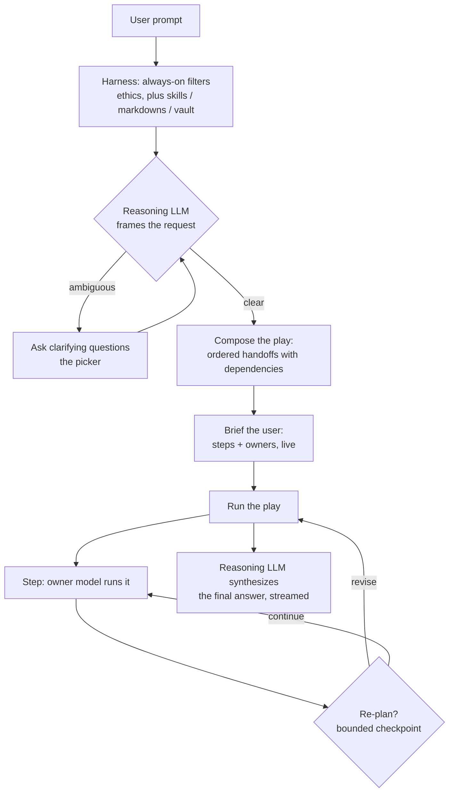

# How OpenShore runs a prompt: the harness, the game plan, and the play

OpenShore turns a prompt into a run the way a coach runs a play. My Stack is the
anchor. The reasoning LLM frames the request, draws up a play (an ordered set of
handoffs to the specialist models, with dependencies), shows you a brief, and
runs it. This is the single, explicit workflow the app is built around.

## The linear flow

**Stage 0, setup.** A chat or project connects to its repos and inherits its
markdowns and instructions. My Stack for the current status (Offline / Offshore
/ Docked) is loaded: the reasoning LLM (required; Harbor Light by default, which
nudges you to install a real one) plus its specialist categories.

**Stage 1, the harness.** Every prompt flows through the hybrid harness:
always-on filters (ethics) plus curatable ones (skills, preset markdowns, the
vault). Ethics can never be turned off; the rest you curate.

**Stage 2, framing.** The reasoning LLM reads the prompt and frames it. It asks
clarifying questions only when a wrong assumption would waste real work; most
prompts are clear and run straight through. Your answers fold back in and it
re-frames.

**Stage 3, the play.** Once clear, the reasoning LLM composes the play: an
ordered list of steps, each owned by a category (or a specific model, see
below), with dependencies so a coding step can feed a writing step that feeds a
vision step. Any category with no placed specialist is run by the reasoning LLM
itself.

**Stage 4, the brief.** Before it runs, you see the play as a short checklist,
each step with its owner (the model that will run it), updated live. Crisp, no
more than the play needs.

**Stage 5, run.** Steps run in dependency order. Each hands off to its owner;
results pass forward. At bounded checkpoints the reasoning LLM can re-plan the
remaining steps if a result changed the picture (the hybrid model). The final
answer is composed by the reasoning LLM and streamed to you.

**A level deeper.** Beyond the standard categories, a step can name a specific
model to run it, so a particular subject or decision goes to a particular model.
Place that model in the stack (a Custom specialist with a "when it is called"
trigger is the simplest way), and the reasoning LLM can target it by id when it
draws up the play.

## Where it runs

App-native. The framing, play, brief, and execution run in the app over My
Stack (so it works on the phone alone). A step that must edit a repo or run
commands is marked and, when you are docked to your computer, hands off to the
engine harness there; when you are not docked it describes the exact change
instead of pretending to make it. The reasoning anchor being a weak on-device
model, an unreachable model, or a single-step request all fall back to a plain
routed answer, so a modest stack still just works.

## The code

- Pure core: `app/src/lib/play.ts` (the shapes, dependency scheduling, re-plan
  merge, owner resolution, the brief, the planner and re-plan prompts and their
  robust JSON parsing). Fully unit-tested in `app/test/play.test.ts`.
- The runner: `app/src/drivers/stackDriver.ts` (frames, briefs as todos with
  owners, runs steps, re-plans, synthesizes; degrades to single-turn).
- The brief UI: the todo card renders each step with its owner
  (`app/src/components/TodoCard.tsx`, `owner` on `TodoItem`/`TodoRow`).

## Follow-ups

- The clarifying questions render as a chat message today (functional); the
  tappable picker (option chips) is the next polish.
- Engine execution of a repo/tool step from this flow when docked (today the
  step describes the change; the paired-engine hand-off is wired as a seam).
- Bringing the same play flow to the desktop-engine routine path (routines run
  on the engine's own router today).
